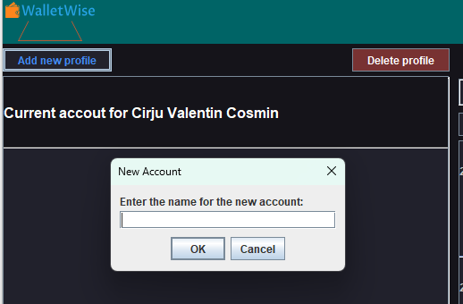
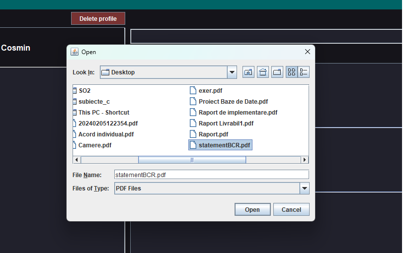

# WalletWise - Manager cheltuieli și venituri personale

### Cîrju Valentin Cosmin

## Descriere

O aplicație desktop în Java pentru contorizarea cheltuielilor
și veniturilor. Este un instrument care ajută la
înregistrarea și monitorizarea tranzacțiilor financiare
personale. Cu această aplicație, puteți adăuga, gestiona
și să vedeți soldurile conturilor pentru
o mai bună gestionare a bugetului.
Este un instrument util pentru urmărirea financiară personală.

## Obiective

GUI:

- **Clasa Login(main)**
- **Clasa Register**
- **Clasa Home**

DataBase:

- **Clasa Account**
- **Clasa Crypto**
- **Clasa jdbc**
- **Clasa Transaction**
- **Clasa User**

## Arhitectura

<h1 align="center"><strong>Functionalitati/Exemple utilizare</strong></h1>

### Interfață grafică (GUI)

### Gestionarea conturilor

### Adăugarea tranzacțiilor

### Vizualizarea și editarea datelor

### Calcularea soldurilor

### Căutare

### Import de date (Statement PDF [RFB, RVT, BCR])

### Resurse

Markdown Guide, [Online] Available: https://www.markdownguide.org/basic-syntax/ [accesed: Mar 14, 1706]

How to use JDatePicker, [Online] Available: https://www.codejava.net/java-se/swing/how-to-use-jdatepicker-to-display-calendar-component

MySQL Connector, [Online] Available: https://dev.mysql.com/downloads/connector/j/

PDFBox, [Online] Available: https://pdfbox.apache.org/
